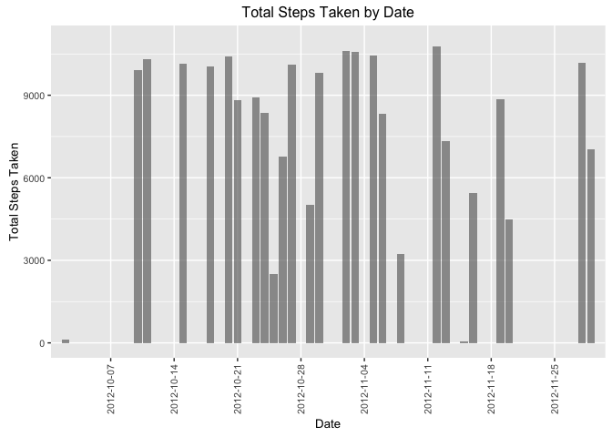
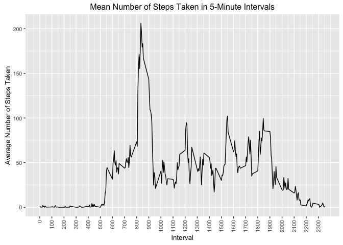
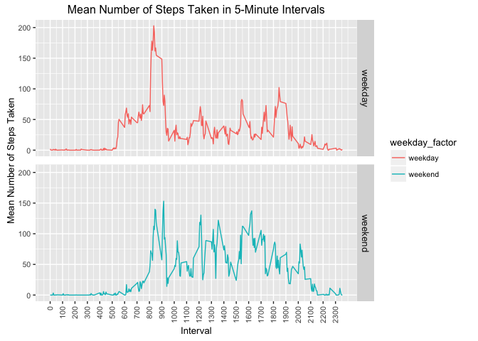

# Reproducible Research: Peer Assessment 1
et408  

### Data collected from a subject wearing personal activity monitoring device is analyzed in this assignment

Raw activity data (measured in the number of steps taken in a 5-minute interval) is loaded to a data frame from activity.csv. The columns of the data frame are `date`, `steps` and `interval`, where `steps` is the number of steps recorded in the given interval. `interval` is a factor variable with levels $$\{0, 5, ..., 55, 100, 105, ..., 150, 155, ..., 2300, ..., 2355\}$$ which describe the set of 5-minute time intervals given by $$\bigcup _{i=0}^{23} \bigcup _{j=0}^{11}\big[100i+5j, 100i+5j+5\big)$$ In longhand, the intervals are $$\{[0,5), [5,10), ..., [55,60), [100, 105), ..., [155,160), ..., [2300, 2305), ..., [2355, 2400)\}$$ The endpoints of the intervals encode the hour of the day and the minute of the hour. Given an interval [$\epsilon$, $\epsilon$+5), $\epsilon$ mod 100 is the hour of the day on the 24-hour clock, and $\epsilon$ - 100($\epsilon$ mod 100) is the minute of the hour. For example, the `interval` factor level 0 is for the time interval [12:00 midnight, 12:05 a.m.), and the `interval` factor level 1645 is for the time interval [4:45 p.m., 4:50 p.m.). The data cover 61 consecutive days beginning with October 1st, 2012, and there are 288 5-minute intervals in a day. Thus, there are 17586 observations.
 
## Loading and preprocessing the data
The raw data are loaded from the file `activity.csv` into the data frame `activity_raw`. No pre-processing is needed.

```r
# Reading raw activity data into 'activity_raw' data.frame
activity_raw <- read.csv("activity.csv")
head(activity_raw)
```

```
##   steps       date interval
## 1    NA 2012-10-01        0
## 2    NA 2012-10-01        5
## 3    NA 2012-10-01       10
## 4    NA 2012-10-01       15
## 5    NA 2012-10-01       20
## 6    NA 2012-10-01       25
```

```r
summary(activity_raw)
```

```
##      steps                date          interval     
##  Min.   :  0.00   2012-10-01:  288   Min.   :   0.0  
##  1st Qu.:  0.00   2012-10-02:  288   1st Qu.: 588.8  
##  Median :  0.00   2012-10-03:  288   Median :1177.5  
##  Mean   : 37.38   2012-10-04:  288   Mean   :1177.5  
##  3rd Qu.: 12.00   2012-10-05:  288   3rd Qu.:1766.2  
##  Max.   :806.00   2012-10-06:  288   Max.   :2355.0  
##  NA's   :2304     (Other)   :15840
```


## Tallying intervals with `NA` values
The number of 5-minute intervals lacking step measurements is tallied. There are 2304 of 17586 observations for which `steps` has the value `NA`.

```r
# Logical vector indicating if no steps were measured on a given 5-minute interval
activity_steps_na_logical <- is.na(activity_raw$steps)
# Number of time intervals in which no steps were measured
sum(activity_steps_na_logical)
```

```
## [1] 2304
```

## What is the total number of steps taken per day?
The intervals are grouped by day, and the sum of `steps` per day is calculated and plotted in a histogram.

```r
# Aggregate steps by date
steps_by_date <- aggregate(activity_raw$steps, 
                           by = activity_raw["date"], 
                           FUN = sum, 
                           na.action = NULL)
x_tick_labels <- steps_by_date$date[seq(0,62,7)]
require(ggplot2)
plot_text <- element_text(size = 10)
plot_theme <- theme(text = plot_text, strip.text = plot_text, axis.title = plot_text, 
                    legend.margin = unit(3, "mm"), panel.margin.x = unit(10, "mm"),
                    panel.margin.y = unit(3, "mm"))
h_vertical_x_axis_theme <- theme(axis.text.x = element_text(angle = 90, hjust = 0, vjust = 0.5))
# Historgram of steps by date
h <- ggplot(steps_by_date, aes(date, x)) + 
  geom_bar(stat = "identity", width = .85, na.rm = TRUE, alpha = .6) + 
  ggtitle("Total Steps Taken by Date") +
  xlab("Date") +
  ylab("Total Steps Taken") +
  ylim(0, 11000) +
  plot_theme +
  scale_x_discrete(breaks = x_tick_labels) +
  h_vertical_x_axis_theme
print(h)
```

```
## Warning: Removed 34 rows containing missing values (position_stack).
```



Note that, per the warning, 34 of the 61 days have no step measurements, and are omitted from the plot. This agrees with the histogram which depicts 27 days with `step` values.

## What are the mean and median steps taken per day?
`NA` values are omitted, and the mean and median of `steps` per day are calculated.

```r
# Mean and median of steps taken per day
mean_and_median_per_day <- data.frame(mean = mean(steps_by_date$x, na.rm = TRUE), 
                                      median = median(steps_by_date$x, na.rm = TRUE))
mean_and_median_per_day
```

```
##       mean median
## 1 10766.19  10765
```

## What is the average daily activity pattern?
The data frame `activity_raw` is grouped by interval, and mean of steps taken per interval is calculated. The results are plotted in a line graph.ff

```r
avg_steps_by_interval <- aggregate(activity_raw$steps, 
                                   by = activity_raw["interval"], 
                                   FUN = mean, 
                                   na.rm = TRUE)
t1_vertical_x_axis_theme <- theme(axis.text.x = element_text(angle = 90, hjust = 1, vjust = 0.5))
t1 <- ggplot(avg_steps_by_interval, aes(interval, x)) +
    geom_line() +
    ggtitle("Mean Number of Steps Taken in 5-Minute Intervals") +
    xlab("Interval") +
    ylab("Average Number of Steps Taken") +
    scale_x_continuous(breaks = seq(0, 2300, by = 100)) +
    t1_vertical_x_axis_theme +
    plot_theme
print(t1)
```



## Which interval has the maximum mean number of steps?

```r
max_mean_interval_number <- avg_steps_by_interval[avg_steps_by_interval$x == max(avg_steps_by_interval$x, na.rm = TRUE),]$interval
# Start time of interval with maximum mean number of steps
library(lubridate)
max_mean_hour <- floor(max_mean_interval_number / 100)
max_mean_minute <- max_mean_interval_number %% 100
max_mean_time <- hm(paste(max_mean_hour, max_mean_minute, sep = ":"))
max_mean_time
```

```
## [1] "8H 35M 0S"
```

The 5-minute interval starting at 8:35 a.m. has the maximum mean number of steps. This is consistent with the plot above "Mean Number of Steps Taken in 5-Minute Intervals".

## Imputing missing values
`NA` values for `activity_raw$steps` are replaced with `0`.

```r
# Creating 'activity_no_na_steps' by replacing NA steps values in activity with 0 
# (while preserving 'activity_raw')
activity_no_na_steps <- activity_raw
activity_no_na_steps[activity_steps_na_logical,]$steps <- 0
# Number of time intervals in which no steps were measured
activity_steps_0_logical <- activity_no_na_steps$steps == 0
sum(activity_steps_0_logical)
```

```
## [1] 13318
```

## Are there differences in activity patterns between weekdays and weekends?
Activity observations are classified as `weekend` or `weekday` and grouped by `interval` and `weekday_factor`. Then the mean of each interval is calculated, and two line graphs are generated to compare average steps taken per interval on weekdays and weekend days.

```r
library(dplyr)
# Classify each day as weekday or weekend day
activity_no_na_steps_weekend_days <- 
    ifelse(weekdays.Date(strptime(activity_no_na_steps$date, format = "%Y-%m-%d")) %in%
               c("Saturday", "Sunday"), "weekend", "weekday")
weekday_factor <- factor(activity_no_na_steps_weekend_days)
activity_no_na_steps_with_weekday <- cbind(activity_no_na_steps, weekday_factor)
# Group by weekday and take mean of steps per interval
avg_interval_by_weekday <- 
    activity_no_na_steps_with_weekday %>% 
    group_by(interval, weekday_factor) %>% 
    summarise_each(funs(mean), steps)

t2_vertical_x_axis_theme <- theme(axis.text.x = element_text(angle = 90, hjust = 1, vjust = 0.5))
t2 <- ggplot(avg_interval_by_weekday, aes(interval, steps)) +
    geom_line(aes(color = weekday_factor)) +
    facet_grid(weekday_factor ~ ., scales = "fixed") +
    ggtitle("Mean Number of Steps Taken in 5-Minute Intervals") +
    xlab("Interval") +
    ylab("Mean Number of Steps Taken") +
    t2_vertical_x_axis_theme +
    scale_x_continuous(breaks = seq(0, 2300, by = 100)) +
    plot_theme
print(t2)
```



From the plots we see that on average, on weekdays the subject tended to start taking steps around 5 a.m., but on weekends on average the subject did not start taking steps until 6 a.m.. Also, on average the subject was not active until 8 a.m. on weekends. While on weekdays, the subject had a markedly higher peak between 8 a.m. and 9 a.m. when compared to weekend days. The average number of steps the subject took on weekends was higher than on weekdays with several peaks above 100 steps per interval, while on weekdays (excluding the 8 a.m. hour) there was only one interval when the subject topped 100 steps in a 5-minute interval. 
